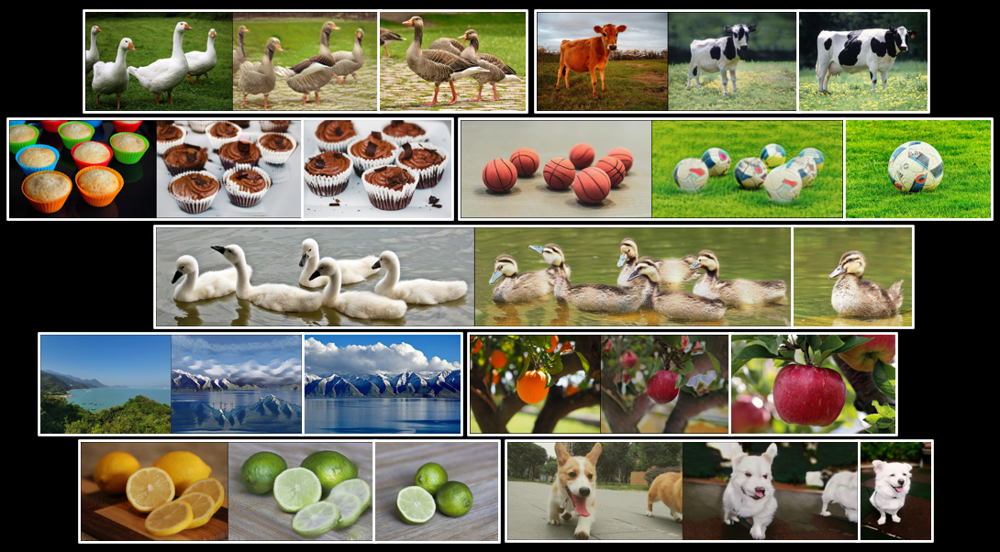

# Splice: Splicing ViT Features for Semantic Appearance Transfer

An unofficial implementation of [Splice (CVPR 2022 Oral)](https://splice-vit.github.io/).



## Getting Started

This code is developed with python version 3.8, PyTorch 1.13.0, CUDA 11.6 and torchvision 0.14.0.

In addition to DINO, we also  investigated the performance of weakly-supervised ViT (CLIP) through feature inversion.
Please download the pre-trained DINO-ViT & CLIP-ViT(optional) from [here](https://drive.google.com/drive/folders/1ZIDaXsq1idD9AoFORIyvZ6fS6zRNPPS1?usp=sharing) and place them in `./checkpoints`.

## Feature Inversion
There are two methods for feature inversion:
1. solely optimizing the image pixels
2. optimizing for the weights of a CNN that translates a fixed random noise z to an output image.

Note that solely optimizing the image pixels is insufficient for converging into a meaningful result, as mentioned in [paper](https://splice-vit.github.io/).

Run example:
```shell
python inversion.py --target=./data/0001.png --use_cnn=True --inv_type=cls --layer=11
```
Run ```python inversion.py --help``` for more details.

## PCA Visualization
PCA visualization of the ViT facets' self-similarity. The leading components mostly capture semantic
scene/objects parts, while discarding appearance information.

Run example:
```shell
python pca_visualization.py --image_path=./data/0001.png --facets=k,t --layers=2,5,11
```
Run ```python pca_visualization.py --help``` for more details.

## Splice Transfer

### Training
By default, we use the pretrained ViT(dino-base-8) as feature extractor. Given two images as source and target respectively,
run the following command for training. 

```shell
python splice.py --target=[TARGET_IMAGE_PATH] --source=[SOURCE_IMAGE_PATH]
```

### Inference

```shell
python inference.py --ckpt=[GENERATOR_CHECKPOINT_FILEPATH] --source=[INPUT_IMAGE_FILEPATH] --output=[OUTPUT_DIRECTORY] --name=[OUTPUT_IMAGE_NAME]
```

